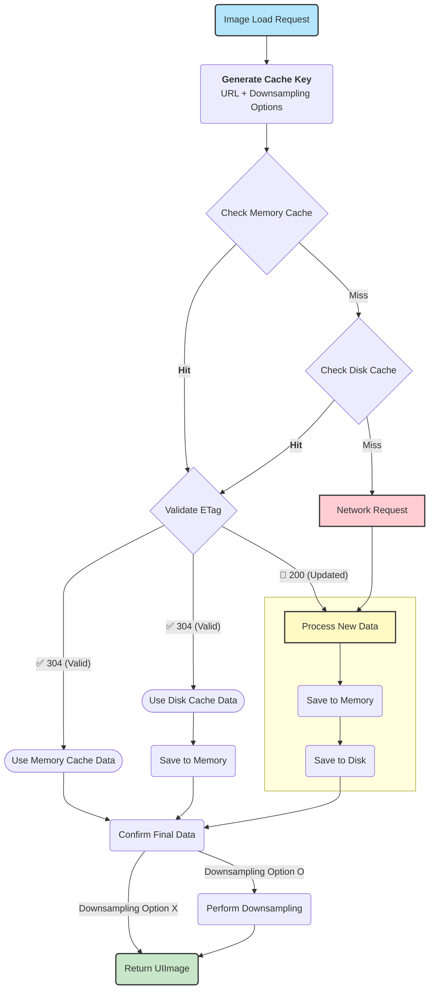

# No: 023, Date: 2025-07-21
## 2025.06.30 ~ 2025.07.20
### ✍️ Xcode Instruments

---

I've used Xcode Instruments a few times to check for memory leaks, but I had never explored other templates. After digging around, I realized there isn't a clear official explanation of each template's purpose, so I compiled a summary of the templates and their usage.

Apple provides a tutorial on detecting hangs and identifying the cause, which I followed.

Previously, we relied on Sentry to detect hangs, which were only caught alongside crashes, making it hard to distinguish between the two. By using the **Time Profiler** template in Instruments, it became much easier to analyze the issue since it immediately notifies you when a certain time threshold is exceeded.

I examined all our apps using the appropriate templates and found that it would greatly help improve overall service performance.

In addition, you can use **Firebase Performance Monitoring** to measure performance. Since Remote Config is a dependency, it gets installed automatically, but you can disable it as needed. This makes it easy to integrate without affecting live services while gaining access to valuable performance insights.

- Out-of-the-box, it provides data on app launch time, foreground/background activity, rendering time, network duration, etc., and allows custom metrics too.

### 💾 Memory Management

---

While checking for memory leaks, I reviewed and organized core iOS memory concepts again.

I also watched related WWDC sessions.

Proper memory management boosts app launch speed, improves overall performance, and helps your app (and others) stay longer in memory.

> Swift: Deep Copy, Shallow Copy, COW

- **Deep Copy**: Copies data to a new memory space
- **Shallow Copy**: Copies the reference (memory address) only
- **COW (Copy On Write)**: Starts as a shallow copy and performs a deep copy only when values are modified

Note: For reference types to support deep copying, the `NSCopying` protocol is typically used.

Before using Instruments or libraries, I listed common cases where memory leaks occur to remain mindful of them during development.

### ⚒ ImageLoader Implementation

---

As part of a functional programming course, there was an assignment to implement an ImageLoader using functional concepts. While building it, I realized it would be helpful to package it with features like E-Tag and downsampling so it could be reused across multiple projects.

I organized concepts such as E-Tag, memory cache, disk cache, and downsampling.

- Memory cache uses `NSCache`
- Disk cache uses `FileManager`
- Used `Result+Extension` to handle success and failure as separate flows within a single pipeline

I also read various blog posts where developers built their own custom ImageLoaders. One that implemented `NSCache` entirely in Swift stood out.

You can see the flow in the diagram below. This will be included in [my-swift-package](https://github.com/sookim-1/my-swift-package).

### 🙋🏻‍♂️ Other Notes
1. I had been using Monica for Chrome website translation, but recently switched to Immersive Translate, which focuses solely on translation. It felt faster and more efficient, so I made the switch. Highly recommend it.
2. I’ve been gradually migrating to Swift 6 and referred to the official migration guide. After enabling the compiler option, I reviewed warnings and rewrote singleton implementations using Swift 6 syntax.
3. I watched the full n8n tutorial. As I explored the workflow system using IF nodes and LOOP nodes, it felt very much like building actual functions and programs. Knowing the core nodes is crucial for writing effective workflows.
4. Over the weekend, I used MAKE to create a workflow that saves video metadata from a specific YouTube channel to Google Sheets using the YouTube API. I used this to archive SwiftUI content from KavSoft for future reference.
5. As my GitHub repositories increased, I renamed them to maintain a consistent naming convention. After comparing kebab-case and snake_case, I found kebab-case to be more suitable for repository URLs.
