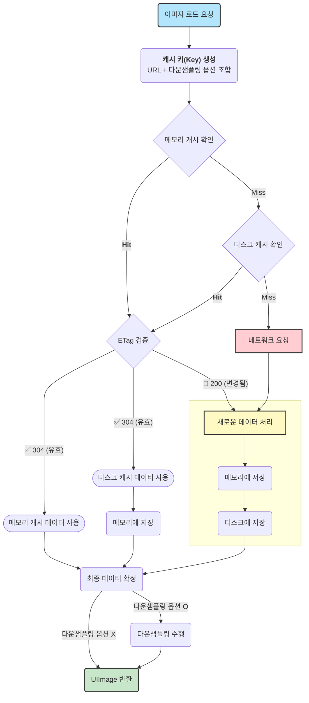

# 번호 : 023, 작성일자: 2025-07-21
## 2025.06.30 ~ 2025.07.20
### ✍️ Xcode Instrument

---

Xcode Instruments로 메모리 누수 점검은 몇번 해봤지만 다른 템플릿의 Instrument를 사용해본 적이 없어 여기저기 확인해봤는데 템플릿들에 대해 정리한 내용이 공식문서에도 없어 각 템플릿의 목적과 Instrument에 대해서 정리했습니다.

Apple에서 Hang을 감지하는 방법과 원인을 파악해 수정하는 튜토리얼을 제공해 따라했습니다.

기존에 Hang을 Sentry에서 감지될 때 Crash가 발생할 때 같이 감지되서 Crash로 인한 Hang인지 정말 Hang만 발생한 건지 원인에 대해 파악하기 어려웠는 데 Instruments의 Time Profiler 템플릿을 사용해서 분석하게 되니까 설정한 시간을 초과하면 바로 알려줘서 파악하기 쉬웠습니다.

각 템플릿들의 목적에 맞게 개발한 앱들을 전체 점검해보았는데 서비스 향상에 도움이 될 것 같았습니다.

성능을 검사할 때 추가로 Firebase Performance Monitoring 을 사용할 수 있는 데 Remote Config가 의존성을 가져 자동으로 설치되어 필요할 때 마다 비활성화를 할 수 있어서 크게 서비스 중인 앱에도 영향도가 적고 성능 정보를 얻고 싶을 때 유용할 것 같습니다.

- 기본적으로 제공하는 정보가 앱 시작 시간, 포어그라운드, 백그라운드 활동 시간, 렌더링 시간, 네트워크 시간 등등을 제공하고 커스텀으로 추가도 가능했습니다.

### 💾 메모리 관리

---

메모리 누수점검을 진행하면서 다시 한번 iOS  메모리 개념도 정리했습니다.

관련 WWDC를 시청했습니다.

메모리 관리를 잘해야 앱 실행 속도시스템 , 전체 성능 향상, 직접 만든 앱 외에 다른 앱들도 메모리에 오래 머물 수 있습니다.

> Swift의 깊은 복사, 얕은 복사, COW
    
    
- 깊은 복사 : 복사할 때 별도의 메모리에 적재되는 복사
- 얕은 복사 : 메모리에 적재하지 않고 주소값만 복사
- COW(Copy On Write) : 처음 얕은 복사를 진행하고 값이 변경될 때 깊은 복사

참고로 얕은 복사하는 참조타입을 깊은 복사가 가능하도록 NSCopying 프로토콜을 사용합니다.

Xcode Instruments나 라이브러리 사용 하기 전에 항상 인지하도록 메모리 누수가 자주 발생하는 케이스를 정리했습니다

### ⚒ ImageLoader 구현

---

함수형프로그래밍 강의를 들으면서 과제 중 ImageLoader를 함수형으로 구현하기가 있었는 데 해당 객체를 만들면서 E-Tag와 다운샘플링도 적용된 ImageLoader 패키지를 만들면 여러 프로젝트에서 사용하기 편리할 것 같아 개발을 시작했습니다.

E-Tag, 메모리캐시, 디스크 캐시, 다운샘플링 등의 개념을 정리했습니다.

메모리캐시는 NSCache를 사용, 디스크 캐시는 FileManager를 사용했습니다.

Result+Extension을 통해 실패할 때 와 성공했을 때 플로우를 하나의 파이프라인에서 각각 실행시킬 수 있습니다.

여러 블로그에서 개인 ImageLoader를 다양하게 구현한 글들이 많았고 NSCache 대신에 직접 Swift용으로 구현한 분도 인상적이였습니다.

아래 플로우차트로 동작방식을 확인할 수 있고 [my-swift-package](https://github.com/sookim-1/my-swift-package)에서 활용할 예정입니다.

### 🙋🏻‍♂️ 기타 사항

---

1. Chrome 확장 프로그램 중 웹사이트 번역을 [Monica]([https://chromewebstore.google.com/detail/monica-chatgpt-ai-어시스턴트-d/ofpnmcalabcbjgholdjcjblkibolbppb?hl=ko](https://chromewebstore.google.com/detail/monica-chatgpt-ai-%EC%96%B4%EC%8B%9C%EC%8A%A4%ED%84%B4%ED%8A%B8-d/ofpnmcalabcbjgholdjcjblkibolbppb?hl=ko))를 사용하고 있었는 데 완전히 번역만을 위한 [몰입형번역]([https://chromewebstore.google.com/detail/몰입형-번역-웹-사이트-번역-확장-프로그램-p/bpoadfkcbjbfhfodiogcnhhhpibjhbnh?hl=ko](https://chromewebstore.google.com/detail/%EB%AA%B0%EC%9E%85%ED%98%95-%EB%B2%88%EC%97%AD-%EC%9B%B9-%EC%82%AC%EC%9D%B4%ED%8A%B8-%EB%B2%88%EC%97%AD-%ED%99%95%EC%9E%A5-%ED%94%84%EB%A1%9C%EA%B7%B8%EB%9E%A8-p/bpoadfkcbjbfhfodiogcnhhhpibjhbnh?hl=ko)) 이 번역기능만 있어서 속도 차이가 있어서 변경하였습니다. 유용한 프로그램 같습니다.
2. Swift 6 마이그레이션을 점진적으로 진행하기 위해 공식 가이드를 보았습니다. 일단 컴파일러에서 옵션을 설정하고 경고등을 확인한 후 싱글톤을 사용할 때 Swift 6로 구현해봤습니다.
3. [n8n 튜토리얼](https://www.youtube.com/watch?v=4BVTkqbn_tY&list=PLlET0GsrLUL59YbxstZE71WszP3pVnZfI&index=1&t=16s) 을 전체 한번 확인했습니다. 자동화를 보면서 IF노드, LOOP 노드 등을 보면서 워크플로를 구축하는 것은 함수를 작성하거나, 프로그램을 만드는 프로그래밍 같았습니다. Core 노드등은 기본적으로 숙지해야 워크플로 작성히 수월한 것 같습니다.
4. 주말에 MAKE에서 Youtube API를 활용하여 특정 채널 영상정보들을 구글시트에 저장하는 워크플로를 작성했습니다. 해당 워크플로로 KavSoft에 게시된 SwiftUI 글들을 필요할 때 확인하도록 저장했습니다.
5. Github 저장소가 점점 많아지며 관리를 위해 저장소명을 통일성 있게 수정했습니다. 저장소명이 길어질때 케밥케이스와 스네이크케이스 중에서 비교했는데 URL로도 저장소명이 사용될 수 있어 케밥케이스가 적합하다고 판단했습니다.
