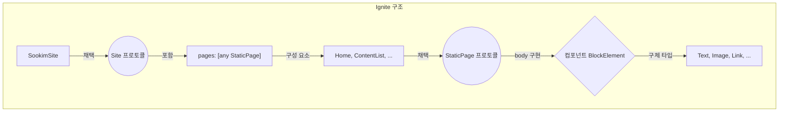

이전에 포스팅한 글에서 소개했듯이, 저는 Swift로 정적 사이트를 만들 수 있는 [Publish](https://github.com/johnsundell/publish) 라이브러리를 사용하여 T.W.L(This Week I Learned) 블로그를 만들어 운영하고 있었습니다.

그러던 중, 또 다른 Swift로 정적웹사이트를 만들 수 있는 [Ignite](https://github.com/twostraws/Ignite)를 발견하고 몇가지 저만의 기준으로 장점이 있다고 생각하여 Migration을 해야겠다고 생각했습니다.

> Migration 도입해야겠다고 생각한 기준
1. [Ignite 공식샘플](https://ignitesamples.hackingwithswift.com/)을 둘러봤는데 SwiftUI처럼 컴포넌트를 조립하여 웹사이트를 편리하게 구성가능할 것 같았습니다.
2. Hacking With Swift라는 유명한 iOS 강의서비스를 만든 Paul Hudson님이 직접 만들고 관리 중이여서 신뢰도가 높았습니다.
3. 라이브러리 자주 업데이트되고 있었습니다.
4. 라이브러리 공식문서가 잘 정리되어있었습니다.

도입결정을 했기 때문에 기존 Publish 기반의 코드는 별도의 [Archive 저장소](https://github.com/sookim-1/Arcihive_Publish_Blog)에 보관하고 Github Page는 하나의 저장소만 사용가능하여 Vercel을 통해 호스팅을 유지했습니다.

## Ignite 구조 분석

먼저 Ignite에서 어떻게 웹사이트를 만들고 동작하는지에 대해 살펴봤습니다.

- Ignite는 `Site` 라는 최상위 프로토콜을 중심으로 동작합니다. 이 프로토콜을 채택하는 구조체(예: `SookimSite`)를 만들어 웹사이트 전체 구성(이름, URL, 포함될 페이지 등)을 정의합니다.
- `Site`의  `pages` 프로퍼티는 **정적 페이지(`StaticPage`)** 들의 배열입니다. 웹사이트에 포함될 페이지를 이곳에 등록합니다.
- `layouts` 프로퍼티는 **마크다운(`.md`) 파일**의 콘텐츠를 어떤 UI 구조로 보여줄지 정의합니다.




정리하면 각 페이지 UI를 BlockElement를 채택하는 컴포넌트들로 UI를 구성한 후 Site를 채택하는 객체를 만들면 웹사이트를 만들 수 있습니다.

> Site.swift

```swift
import Ignite

@main
struct IgniteWebsite {
    static func main() async {
        let site = SookimSite()

        do {
            try await site.publish()
        } catch {
            print(error.localizedDescription)
        }
    }
}

struct SookimSite: Site {
    var name = "sookim-1"
    var titleSuffix = " – My T.W.L Site"
    var url = URL(string: "https://sookim-1.github.io")!
    var builtInIconsEnabled = true

    var author = "sookim-1"

    var homePage = Home()
    var theme = MyTheme()
    var tagPage = Tags()
    var favicon = URL(string: "/images/favicon.png")
    var feedConfiguration = FeedConfiguration(mode: .full, contentCount: 20, image: .init(url: "https://sookim-1.github.io/images/favicon.png", width: 32, height: 32))

    var pages: [any StaticPage] {
        Home()
        ContentList2024()
        ContentList2025()
        ContentListEn2024()
        ContentListEn2025()
    }
    
}


```
[수킴의 개인 T.W.L](https://sookim-1.github.io/)를 살펴보면 Home, 2024 회고록 목록, 2025 회고록 목록 페이지들로 구성되어 있습니다.

Home : 홈페이지 소개하는 페이지입니다. 주 기능은 마크다운 문서 목록 페이지로 이동합니다.
ContentList2024 : 2024년 T.W.L 마크다운 문서 목록을 간략하게 보는 페이지입니다.
ContentList2025 : 2025년 T.W.L 마크다운 문서 목록으로 위와 동일한 레이아웃 페이지입니다.

## 블로그 기본 구조 구현

Ignite에서는 NavigationBar 와 Footer를 제공해서 Home 진입페이지를 제외한 모든 페이지에 모두 적용했습니다.

> 공통 컴포넌트: NavigationBar 구현

```swift
import Ignite

struct NavBar: Component {

    func body(context: PublishingContext) -> [any PageElement] {
        NavigationBar(logo: "수킴의 개인 T.W.L")
                .navigationItemAlignment(.trailing)
                .navigationBarStyle(.dark)
                .background(.steelBlue)
                .position(.fixedTop)
    }

}
```

페이지 상단의 네비게이션바를 구현하기위해 NavigationBar Component를 구성했습니다. SwiftUI처럼 선언형으로 UI 속성을 설정할 수 있어 매우 직관적이었습니다.

> 공통 컴포넌트: Footer 구현

```swift
public struct SocialFooter: Component {
    let icons = [
        Image(systemName: "github"),
        Image(systemName: "linkedin")
    ]

    let urlStrings = [
        "https://github.com/sookim-1",
        "https://www.linkedin.com/in/sookim1"
    ]

    public func body(context: PublishingContext) -> [any PageElement] {
        Text {
            for (icon, urlString) in zip(icons, urlStrings) {
                Link(icon, target: urlString)
                    .margin(.trailing, 20)
                    .role(.secondary)
                    .target(.blank)
                    .relationship(.noOpener, .noReferrer)
            }
        }
        .font(.title2)
        .horizontalAlignment(.center)
        .margin(.top, .extraLarge)
    }
}
```

페이지 하단의 풋터바를 구현하기 위해 Footer Component를 구성했습니다.
Footer에 표시할 Github, LinkedIn을 넣을 예정이여서 2가지를 추가했습니다.
몇몇 서비스 이미지들은 Ignite 에 포함되어있어 편리하게 사용할 수 있었습니다.


### 오픈소스 기여 : ContentPreviewStyle 개발 경험

![[ignite_capture1.png]]

마이그레이션 중 가장 흥미로운 경험은 Ignite에 직접 기여한 일이었습니다.

Ignite는 마크다운 콘텐츠 목록을 카드 형태로 보여주는 편리한 `ContentPreview` 컴포넌트를 제공합니다. 하지만 스타일이 고정되어 있어 커스텀이 불가능했습니다.

그래서 스타일을 변경할 수 있으면 좋을 것 같다는 아이디어가 생겨서 개발을 진행했습니다.


그래서 ContentPreview 구현부를 확인했습니다. 

```swift
import Foundation

/// A wrapper around Card, specifically aimed at presenting details about
/// some content on your site. This automatically links to your content page
/// and adds in tags.
public struct ContentPreview: BlockElement {
    var content: Content

    /// The standard set of control attributes for HTML elements.
    public var attributes = CoreAttributes()

    /// How many columns this should occupy when placed in a section.
    public var columnWidth = ColumnWidth.automatic

    public init(for content: Content) {
        self.content = content
    }

    public func render(context: PublishingContext) -> String {
        Card(imageName: content.image) {
            Text(content.description)
                .margin(.bottom, .none)
        } header: {
            Text {
                Link(content)
            }
            .font(.title2)
        } footer: {
            let tagLinks = content.tagLinks(in: context)

            if tagLinks.isEmpty == false {
                Group {
                    tagLinks
                }
                .style("margin-top: -5px")
            }
        }
        .attributes(attributes)
        .render(context: context)
    }
}
```

render 함수를 간단히 확인해보면 상단에 링크가 연결된 제목, 본문에는 설명과 이미지, 하단에 태그목록들을 표시하는 카드로 고정되어 있었습니다.

이렇게 고정되어있어 저는 T.W.L 블로그의 핵심이 마크다운문서 미리보기 스타일을 여러가지 스타일로 변경하고 싶었습니다. 

> 1. 클로저 접근기반으로 스타일 지정

```swift
public struct ContentPreview: BlockElement {
    
    ...

	/// The layout block element for rendering the preview. Defaults to a card if not provided.
    public var customLayout: ((Content) -> BlockElement)?

    /// Initializes the content preview with an optional custom layout.
    /// - Parameters:
    ///   - content: The content to display.
    ///   - customLayout: An optional closure for custom layout.
    public init(for content: Content, customLayout: ((Content) -> BlockElement)? = nil) {
        self.content = content
        self.customLayout = customLayout
    }

    /// Renders the content preview with either a custom layout or the default card.
    /// - Parameter context: The publishing context for rendering.
    /// - Returns: A rendered string of HTML.
    public func render(context: PublishingContext) -> String {
        // Rendering using either custom layout or default card layout.
        if let customLayout {
            return customLayout(content)
                .attributes(attributes)
                .render(context: context)
        } else {
            return defaultCardLayout(context: context)
                .attributes(attributes)
                .render(context: context)
        }
    }

    /// Default card layout for rendering the content preview.
    /// - Parameter context: The publishing context for rendering tag links.
    /// - Returns: A BlockElement representing the card layout.
    private func defaultCardLayout(context: PublishingContext) -> BlockElement {
        Card(imageName: content.image) {
            Text(content.description)
                .margin(.bottom, .none)
        } header: {
            Text {
                Link(content)
            }
            .font(.title2)
        } footer: {
            let tagLinks = content.tagLinks(in: context)

            if !tagLinks.isEmpty {
                Group {
                    tagLinks
                }
                .style("margin-top: -5px")
            }
        }
    }
    
}
```

처음에는 간단하게 클로저를 통해서 초기화시점에 커스텀스타일을 지정한다면 해당 스타일에 맞게 반환하고 커스텀 스타일을 지정하지 않았다면 기본 스타일을 반환하도록 설정했습니다.
원하는 대로 동작은 했지만, 재사용성과 확장성 측면에서 아쉬움이 남았습니다.


> 2. 피드백을 반영한 SwiftUI 스타일 접근

Contributor가 해당 코드리뷰를 진행해주었는데 클로저방식 대신 Style 프로토콜을 활용하는 SwiftUI 스타일 접근방식을 제안했습니다.
저는 먼저 클로저 기반 접근방식의 단점에 대해 생각해봤습니다.

**클로저 기반 접근방식 `vs` SwiftUI 스타일 접근방식** 
1. **재사용성** : 클로저방식은 여러 곳에서 스타일을 사용하기 어려워 재사용성이 낮았습니다.
2. **가독성** : 클로저방식은 SwiftUI 선언형스타일사이에 클로저가 들어가 있어 가독성이 좋지 않았습니다.
3. **확장성** : 다른 컴포넌트에 추가하기에 프로토콜방식보다는 확장성이 좋지 않았습니다.

```swift

/// A protocol for customizing the layout of ContentPreview.
public protocol ContentPreviewStyle {
    func body(content: Content, context: PublishingContext) -> BlockElement
}

public struct ContentPreview: BlockElement {

	...
	
    /// Custom style for the content preview.
    private var style: ContentPreviewStyle?

    /// Initializes the content preview
    /// - Parameters:
    ///   - content: The content to display.
    public init(for content: Content) {
        self.content = content
    }

    public func contentPreviewStyle<S: ContentPreviewStyle>(_ style: S) -> ContentPreview {
        var copy = self
        copy.style = style
        return copy
    }

    /// Renders the content preview with either a custom layout or the default card.
    /// - Parameter context: The publishing context for rendering.
    /// - Returns: A rendered string of HTML.
    public func render(context: PublishingContext) -> String {
        // If custom style is provided, use it; otherwise, fallback to default layout.
        if let style = style {
            return style.body(content: content, context: context)
                .attributes(attributes)
                .render(context: context)
        } else {
            return defaultCardLayout(context: context)
                .attributes(attributes)
                .render(context: context)
        }
    }
```

클로저방식에서 SwiftUI 방식으로 변경한 후 위에서 언급한 단점들에 대해서 명확히 느껴졌습니다.

1. 원하는 Style의 재사용성이 크게 증가했습니다. ContentPreviewStyle을 채택하는 스타일들을 구현하면 여러곳에서 재사용이 가능했습니다.
2. BlockElement를 사용하는 곳에서도 SwiftUI처럼 수정자가 연결되어 작성되어있어서 가독성이 크게 증가했습니다.
3. 원하는 경우 다른 BlockElement에서도 편리하게 확장 가능해졌습니다.

오픈소스에 기여하면서 피드백을 받고 수정하여 장점을 느껴본 경험은 굉장히 재밌었던 경험이었던 것 같습니다.
- [관련 PR 링크](https://github.com/twostraws/Ignite/pull/129)

최종 결과물은 저는 제목 색상만을 변경하여 사용하게 되었습니다.

![[ignite_capture2.png]]


## 마무리

컴포넌트 구현을 마친 뒤, GitHub Actions 워크플로를 수정하여 배포 자동화까지 완료했습니다. 기존 `Makefile` 대신 워크플로에서 바로 명령어를 사용하도록 변경하고, 마크다운 파일 생성해주는 깃허브 워크플로도Ignite 형식에 맞게 수정했습니다.

Publish에서 Ignite로의 마이그레이션은 단순히 라이브러리를 바꾸는 것을 넘어 Contributor와 소통하며 개선한 좋은 경험이였습니다.

